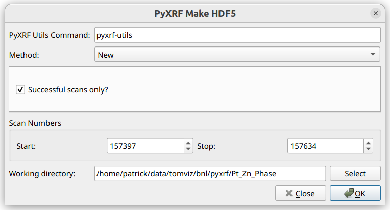
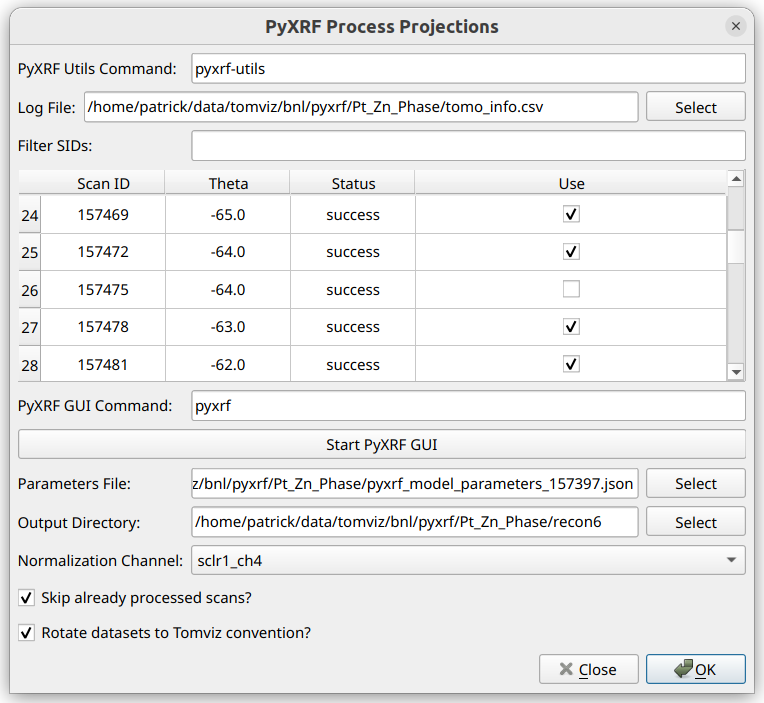
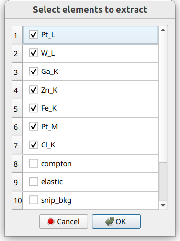
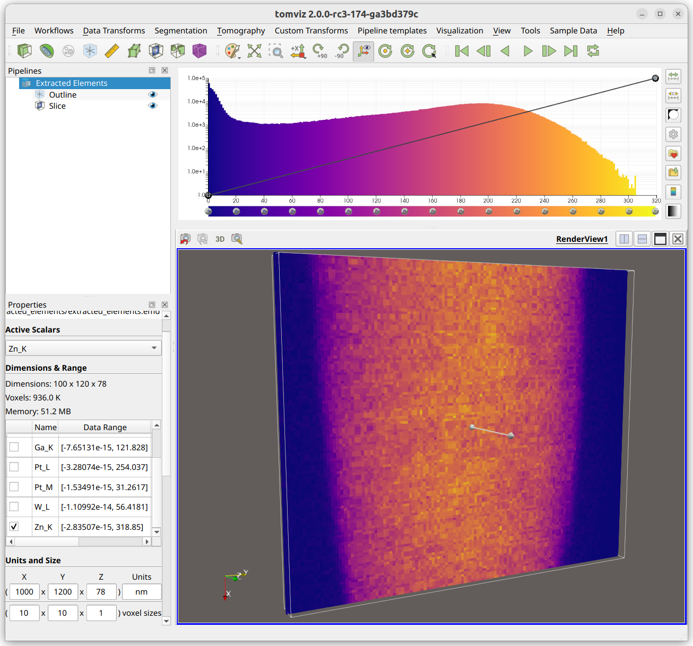
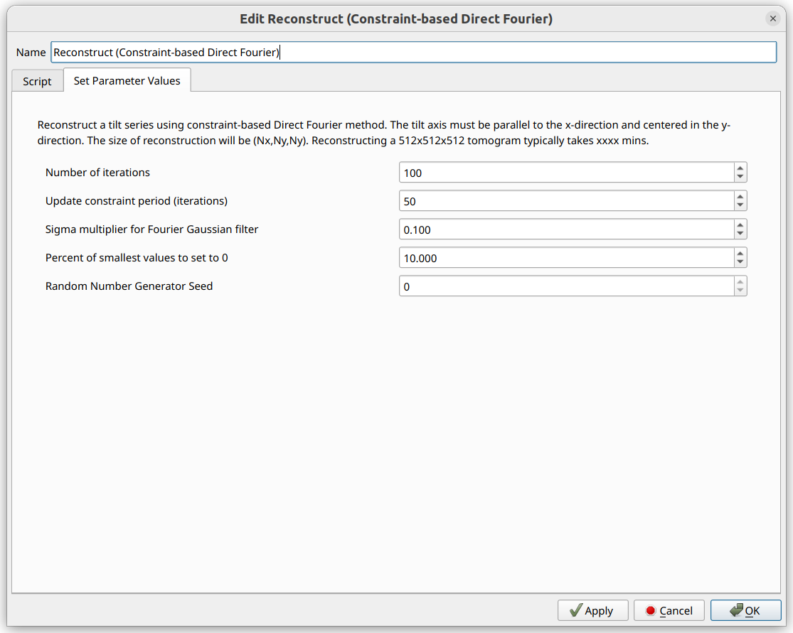
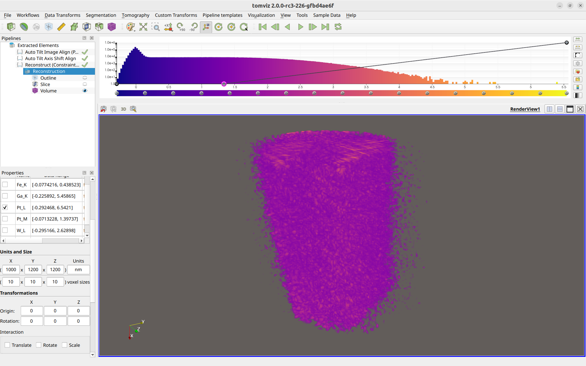
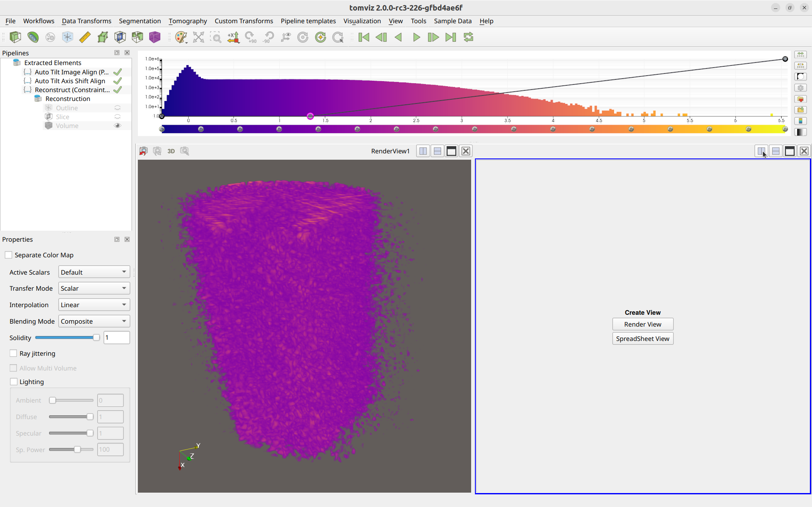
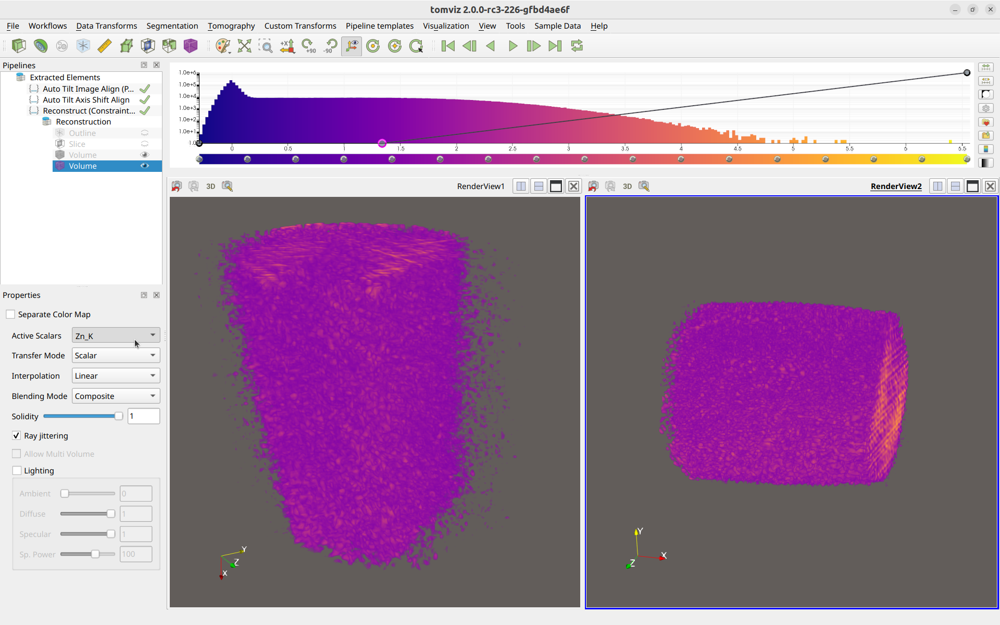
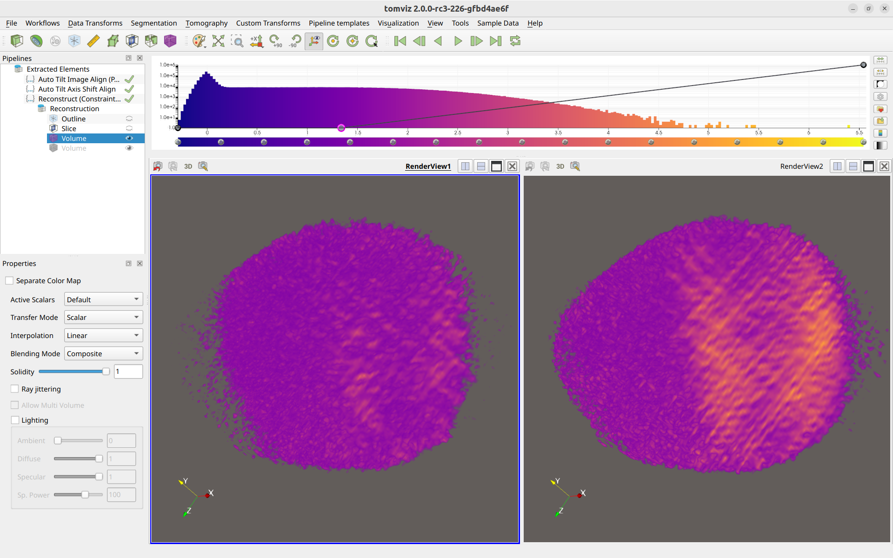
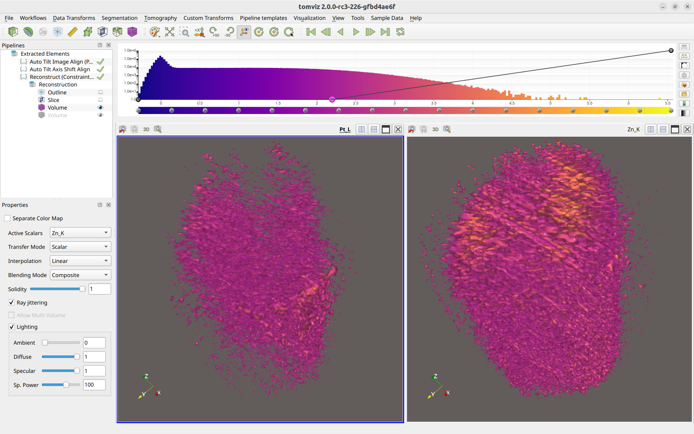

# PyXRF

The PyXRF workflow is intended to streamline the download and processing
of XRF data, particularly for the HXN beamline at NSLS-II.

It utilizes the PyXRF library to download scan data and process projections,
in order to ultimately end up with tilt series image stacks for each element
identified within the data. The resulting data is automatically loaded into
Tomviz.

Steps for the subsequent data analysis of the XRF data are included in Tomviz,
including deleting invalid slices, performing automatic image alignment,
centering the images, performing the 3D reconstruction, and then comparitively
visualizing different reconstructed elements. Those steps are also detailed below.

To begin, click on "Workflows" in the top menu bar, and then select "PyXRF".

## Tutorial Video

  <iframe src="https://drive.google.com/file/d/1_TieRLbtaF34BJD4ESMF9fXCqkC-8ePL/preview" width="760" height="480" allow="autoplay"></iframe>

## Make HDF5

The first step in the PyXRF workflow involves downloading and formatting the
data for PyXRF to use. We call PyXRF functions underneath to do all of this
automatically, and the user just needs to provide the input to these functions.

The dialog appears as the following:

The "PyXRF Utils Command" at the top specifies the command that is to be used
in order to execute PyXRF. Tomviz will run this command as a subprocess with
command-line API expected to match that shown
[here](https://github.com/OpenChemistry/tomviz/tree/master/tomviz/python/tomviz/pyxrf/pyxrf-utils).
This command, however, can easily be a script that sets up and runs the same
command in a different environment. You should just ensure that the command
works for a few examples.

The "Method" combo box selects the provenance of the data, whether it is to
be downloaded ("New") or already exists on disk ("Already Existing").

For "New", the range of scans to be downloaded should be specified through the
"Start" and "Stop" scan IDs (both inclusive). "Successful scans only?" should
be checked in order to skip failed scans. The "Working directory" is where the
data and the CSV log file will be stored.

For "Already Existing", an option is presented to remake the CSV file. If
checked, the CSV file will be remade using the provided scan range and the
data files in the "Working Directory", and the new CSV file will be placed
within that working directory. Remaking a CSV file can be useful if, either
the PyXRF HDF5 files were created beforehand with no CSV file, or if new
data was added that needs to be included in the CSV file.

Once "OK" is clicked, if "New" was selected, progress output will be displayed
from the PyXRF library. It could take some time to finish downloading and
formatting the data. If "Already Existing" was selected, and
"Remake CSV File" is checked, progress output will also be displayed, but this
will likely run relatively quickly.

## Process Projections

Once the data has been fully downloaded and formatted, or an existing data
directory has been specified, the "PyXRF Process Projections" dialog will
appear:

Similar to the Make HDF5 Dialog, there is an option to change the command
for running pyxrf-utils. See the [Make HDF5](#make-hdf5) documentations for
more details about the command.

The next thing to do in this dialog is to ensure that the log CSV file is
selected, as the table will not be populated without it. This file is
automatically generated while making the HDF5 files and may be selected
automatically. If it is not selected, click the "Select" button and navigate
to the file.

Once the log file is selected, the table will be populated as shown, where
each row represents one scan, and its "Scan ID", "Theta" angle, "Status",
and "Use" columns are displayed. One is able to uncheck "Use" for any
scans that should be excluded from the analysis.

The "Filter SIDs" line can be used to filter the displayed SIDs in the table.
This uses numpy-like syntax for selecting values. For example: "157394:157413:3"
would only allow every third number between 157394 (inclusive) and 157413
(exclusive) to be shown. The filtered out SIDs are hidden and won't be used in
the next step. This also supports separate sets of comma-delimited slices, for
example: "157394:157413:3, 157420:157500:2".

After filtering SIDs, and checking/unchecking "Use" for the different SIDs
in the table, PyXRF GUI should be utilized in order to create
the model parameters JSON file. Click "Start PyXRF GUI" in order to
automatically run the GUI. Follow the official [PyXRF Documentation](https://nsls-ii.github.io/PyXRF/)
in order to model and fit elements. Once the results are satisfactory, write
out the parameters JSON file, preferably in the same directory as the data.

Once the parameters JSON file has been created, it should be selected for
the "Parameters File" option.

The "Output Directory" option is the location where the extracted elements
will be written after they are processed. The data will be automatically
loaded into Tomviz, but it is important to note the location for future
reference.

The "Normalization Channel" option should be set to the appropriate
channel. For HXN, it is usually `sclr1_ch4`, which is Ion Chamber 4.

If `Skip already processed scans?` is checked, then any HDF5 files
that already contain the processed results will be skipped over. This
should be unchecked if different processing parameters, such as the
parameters file or the normalization channel, are modified, so that
they will be re-generated again.

"Rotate datasets to Tomviz convention?" should be checked in order to
ensure the resulting tilt image stacks are automatically rotated to the
convention that Tomviz expects, so that the reconstruction operators will
run properly.

After accepting the PyXRF Process Projections dialog, the projections
will be processed. A progress dialog will appear showing the output from PyXRF.
If the datasets have already been processed before, the processed output may
be stored within the original HDF5 dataset files, and those datasets will be
skipped over (unless `Skip already procesed scans?` was unchecked).

There is also an attempt to automatically detect the pixel sizes using the
information from the CSV log file. The first scan number marked "Use" will be
used to determine these pixel sizes. Information about which scan number was
used, and what the computed pixel sizes were, is displayed in the messages
dialog before the PyXRF process projections output.

After processing has finished, the following dialog will appear, where elements
will be selected for extraction and loading:

## XRF Data Analysis

After extraction, the data should automatically load into Tomviz. It may appear
as the following:

Note that the voxel sizes (in the bottom-left corner) are set to match what
was found in the XRF data, if they were available. If these voxel sizes and
the ptychography voxel sizes are both set correctly, that enables the re-use
of some operator transformations/shifts. The voxel sizes in the XRF data
should be verified.

Also note that each element is loaded as a separate array in a single
data source (middle-left). The currently "active" array can be switched to
visualize different arrays in the render window. This "active" array is
also what is used in the operators as `dataset.active_scalars`, so it can
be important to make sure the correct array is selected before running an
operator.

### PyStackReg Image Alignment

A typical next step is to perform image alignment using the PyStackReg
image alignment operator. Before navigating to the operator, first
determine an ideal array (one with a high signal-to-noise ratio) to
use, and also an ideal slice (find a slice close to 0 degrees, or close
to the middle of the image). The ideal array should be selected
as the active array in the data properties panel, and the ideal slice
should be selected in a slice visualization module.

Once these are set up properly, click
"Tomography"->"Image Alignment (Auto: PyStackReg)" in order to open the
PyStackReg operator:

Note that the operator defaults to selecting the `Slice Index` of the
currently viewed slice. That is why selecting an ideal slice before
opening the operator can be helpful.

The PyStackReg operator will determine the transformation matrices using
the currently selected active array, using the selected settings above,
and then apply those same transformation matrices to all arrays. This is
helpful especially for low signal-to-noise datasets, as they will get the
same alignment applied to them as the high signal-to-noise ones.

Select the `Transformation Type`. `Translation` is a good one to start with.
`Padding` can be helpful to ensure the image does not try to wrap around.
This padding gets removed later automatically.

There is also an option to `Save Transformations File`. If a file path is
provided, the transformations, along with other metadata such as pixel
sizes, get saved in NPZ format to the specified path.

This transformations file can then be used in future operations by
selecting `Load From File` for the `Transformation Source`. Because pixel
sizes are saved in the transformations file, those are taken into account
when applying the same transformation to a different dataset with a different
pixel size, such as ptychography.

After selecting all of the options, click `OK`. The operator will run, and
the slices in the output should appear to be much smoother when transitioning
from one to another.

### Tilt Axis Shift Alignment

After performing `PyStackReg` alignment, it can be helpful to center the
data before performing a reconstruction. Navigate to "Tomography" ->
"Tilt Axis Shift Alignment (Auto)" to begin this process.

Several of the options are similar to that of [PyStackReg](#pystackreg-image-alignment),
including the option to load the transformations ("shifts", in this case)
from a file, or save them to a file, along with padding and `Apply to All Arrays`.

This operator randomly selects slices to test, in order to determine the ideal
alignment. For reproducibility, the random number generator seed is provided.

Click `OK` to begin the operation. If the output does not appear to be centered
perfectly, navigate back to the operator settings and try changing the padding,
number of slices, or seed.

### 3D Reconstruction

After aligning the images and centering them, a 3D reconstruction can be
performed. The primary 3D reconstruction operators which we support for the
XRF workflow are the "Constraint-based Direct Fourier Method", and the
"Direct Fourier Method". Click the "Constraint-based Direct Fourier Method"
to begin.

Various reconstruction options are able to be modified here. When the options
appear ideal, click the "OK" button. This reconstruction operator will
iterate through every array, and perform the reconstruction on each array.

Once the reconstruction has finished, a "Volume" module should be created
for the output dataset, and the opacity editor on the histogram at the top
should be modified to visualize the data, like so:

Different arrays can be selected in the Data Properties Panel for viewing.

### Comparatively Visualizing Different Elements

Multiple elements can be visualized simultaneously in separate windows.
To do so, first click one of the "Split" icons in the top-right section of
the render window, like so:

Next, click "Render View". Then left-click on the new render window to make
sure it is selected (it will have a blue border that the other render window
will not have), and then click the "Volume" button to make a new volume.
This will add a new volume to the right render window.

Then, left-click on the new volume in the pipeline, and within the volume
properties in the lower-left panel, select a different array to visualize,
like so:

A different volume is now displayed in the right render window compared to
the left.

The cameras between the render windows can be linked so that they are the
same. To do so, right-click one render window, click "Add Camera Link",
and then left-click on the other render window. The cameras will be
linked together, like so:

Linking the cameras allows for easier comparison of the data between the
two different arrays. You are also able to rename the render windows for
easier remembrance of which is which.

Finally, more realistic rendering can be achieved by enabling lighting
effects in the bottom-left corner, like so:

